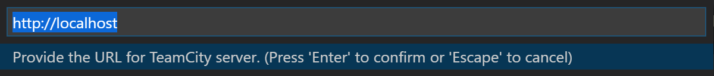
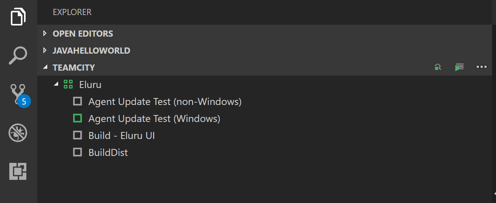
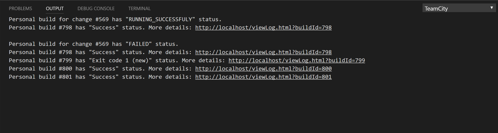

# TeamCity Extension for Visual Studio Code [](https://confluence.jetbrains.com/display/ALL/JetBrains+on+GitHub)

This extension allows you to connect to TeamCity Server and run personal builds on TeamCity server without leaving Visual Studio Code.

## Prerequisites
### Git Version Control
If you are planning on using the extension with Git, ensure your Git version is equal or greater than 2.0.0. The extension uses git command line to collect staged resources and process git commit/push operations. 

### Team Foundation Version Control
Once you have a local TFVC workspace available, you must configure the TFVC support in Visual Studio Code. You can find that information (including demo videos) in the [TFVC documentation](https://github.com/microsoft/vsts-vscode/blob/master/TFVC_README.md).

## Installation
First, you will need to install [Visual Studio Code](https://code.visualstudio.com/download) `1.17.0` or later.

To install the extension with the latest version of Visual Studio Code (version `1.19.1` is the latest as of this writing), download the last pre-released version of the TeamCity extension from [corresponding page](https://github.com/JetBrains/teamcity-vscode-extension/releases), bring up the Visual Studio Code Command Palette (`F1`), type `Install from VSIX` and choose the `teamcity-vscode-extension-***.vsix` file in the opened dialoge box. Restart Visual Studio Code. 

Alternatively, you can also install using the VS Code ```--install-extension``` command line switch providing the path to the .vsix: 
```
code --install-extension myextension.vsix
```
## Authentication
When you are connecting to TeamCity Server, you will only need your TeamCity server credentials (domain name, account name and password).

To sign in to your account, run the `teamcity signin` command. You will be prompted to enter your credentials. When you do and the authorization on the TeamCity server was successful, your credentials will be stored securely on your local macine if the `teamcity.credentials.persistent` setting option is setted as `true`, otherwise only domain name and account name will be stored at the vscode global settings.

**Note:** In order for the extension to be activated, a repository *folder* must be opened. The extension
won't be activated if only a single *file* in the repository is opened.

## Credentials Storage
When you run the `teamcity signin` command and the `teamcity.credentials.persistent` setting option is setted as `true`, the credentials that you provide will be stored securely on your computer. On Windows, your credentials wil be stored by Windows Credential Manager. On macOS, your credentials will be stored in the Keychain. On Linux, your credentials will be stored in a file on your local file system in a subdirectory of your home folder. That file is created only with RW rights for the user running Visual Studio Code.

## Commands
The extension provides several commands for interacting with Team City API. 
In the Command Palette (`F1`), type `TeamTity` and choose a command.

* `TeamCity: Remote Run. Select Files For Remote Run` – Prompts you to choose a resources to send for remote run on the TeamCity server.

* `TeamCity: Remote Run. Find Suitable Build Configurations` – Prompts you to choose build configurations compatible to selected resources.
 When it is used without `TeamCity: Remote Run. Select Files For Remote Run` it takes all files from staged area.

* `TeamCity: Remote Run. Run With Chosen Build Configurations` – Remote run selected files on TeamCity server with selected  build configurations.

* `TeamCity: Signin` – This command is used for signing in to a TeamCity server. When required credentials are provided they are send to TeamCity server 
to validate them and get internal user information. If validation is passed, it will be stored securely if possible on user
computer and used to connect to Team City server.

* `TeamCity: Signout` – This command is used for siggning out from a TeamCity server. 

## Data Provider
The extension uses custom tree data provider to represent resources that could be send to a TeamCity server for remote run and suitable build configurations for them. 


Also data provider contains header with buttons as alternative to typing commands in the Command Palette:
1.  - execute `TeamCity: Remote Run. Select Files For Remote Run` command;
2.  - execute `TeamCity: Remote Run. Find Suitable Build Configurations` command;
3.  - show a context menu that contains next options: 
* `Signin`
* `Remote Run. Find Suitable Build Configurations` 
* `Remote Run. Select Files For Remote Run`
* `Remote Run. Run With Chosen Build Configurations`
* `Signout`

## Detailed Remote Run Results
The extension writes personal build statuses into TeamCity output. This is simple and convenient way to navigate to the Build Overview page.


## Logging
There may be times when you need to enable file logging to troubleshoot an issue. There are four levels of logging (`error`,
`warn`, `info` and `debug`). Since logging is disabled by default, you can add an entry like the one shown below
to Visual Studio Code's Settings and restart VSCode. Once you are finished logging, either remove the setting or set it to an empty string and restart VSCode.
```javascript
"teamcity.logging.level": "debug"
```
The log file will be placed at the root of your workspace and will be named `teamcity-extension.log`.

## Debugging
To start debugging the extension, please, follow the instructions:
1. Clone the repository from the GitHub [repository](https://github.com/rugpanov/teamcity-vscode-extension).
2. Execute `npm install` command from the root of the project.
3. Open the project via the `Visual Studio Code` editor
4. `Debug` -> `Start Debugging` 

## Packaging
To package a custom version of the extension, please, refer to the [VSCode documentation](https://code.visualstudio.com/docs/extensions/publish-extension#_packaging-extensions).

## Support
Support for this extension is provided on my [GitHub Issue Tracker](https://github.com/rugpanov/teamcity-vscode-extension/issues). You
can submit a [bug report](https://github.com/rugpanov/teamcity-vscode-extension/issues/new), a [feature request](https://github.com/rugpanov/teamcity-vscode-extension/issues/new)
or participate in [discussions](https://github.com/rugpanov/teamcity-vscode-extension/issues).

## License
This extension is [licensed under the MIT License](LICENSE.txt).

